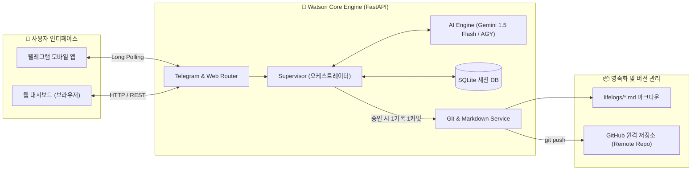

# 🤖 Watson (왓슨) - 24/7 GitHub LifeLog AI Agent

[](https://www.python.org/)
[](https://fastapi.tiangolo.com/)
[](https://www.docker.com/)
[](https://core.telegram.org/bots)
[](https://git-scm.com/)

> **"대화는 가볍게, 기록은 단단하게."**  
> 왓슨(Watson)은 24시간 상시 가동되며 모바일(텔레그램) 및 웹 대시보드를 통해 사용자의 일상을 기록하고, 표준화된 마크다운 라이프로그로 변환하여 GitHub 저장소에 자동 커밋해 주는 **지능형 LifeLog AI 비서(Butler)**입니다.

---

## 🌟 핵심 특징 (Key Features)

- 🧠 **지능형 비서 & 능동 제안 (Smart Butler)**
  - 단순 잡담/인사는 세션에만 보관하고 Git을 어지럽히지 않습니다.
  - 운동, 업무, 할 일 등 기록할 가치가 있는 일과를 감지하면 비서가 먼저 **"라이프로그에 기록할까요?"**라고 인라인 버튼으로 제안합니다.
- 📝 **1기록 1커밋 & 마크다운 영속화 (Git-Backed LifeLog)**
  - 사용자가 승인(`[✅ 응, 기록해줘]`)하거나 직접 명령(`/log`)한 확정된 기록만 `lifelogs/YYYY/MM/YYYY-MM-DD.md`에 카테고리별로 정돈되어 즉시 Git 커밋/푸시됩니다.
- 📱 **모바일 텔레그램 봇 연동 (Zero-Config Mobile Bot)**
  - 복잡한 도메인/SSL 없이 토큰만으로 즉시 구동되는 **비동기 롱 폴링(Long Polling)** 모드 지원.
  - 비인가 접근을 원천 차단하는 **화이트리스트 보안** 및 버튼 한 번으로 기록을 확정하는 **인라인 키보드** 지원.
  - 사진과 일과 메모를 함께 전송하면 자동으로 첨부파일을 다운로드하고 마크다운에 연동.
- 🖥️ **올인원 웹 대시보드 (Web Dashboard)**
  - 실시간 웹 채팅, 날짜/채널별 세션 기록 조회, 오늘 작성된 마크다운 라이프로그 실시간 렌더링 뷰어 제공.
- 🐳 **24/7 원클릭 서버 배포 (Docker & Docker Compose)**
  - Oracle Cloud, AWS, GCP, 홈 서버 등 어디서든 명령어 한 줄(`docker compose up -d`)로 24시간 무중단 가동.

---

## 🏗️ 시스템 아키텍처



---

## 📋 사전 준비 사항 (Prerequisites)

1. **Google Gemini API Key**:
   - [Google AI Studio](https://aistudio.google.com/)에서 무료로 발급받을 수 있습니다.
2. **텔레그램 봇 토큰 (모바일 사용 시)**:
   - 텔레그램 앱에서 [@BotFather](https://t.me/botfather)를 검색하고 `/newbot` 명령어로 봇을 생성하여 토큰을 발급받습니다.
   - 자신의 Chat ID 확인: [@userinfobot](https://t.me/userinfobot)에게 아무 메시지를 보내 `Id` 숫자를 확인합니다.
3. **GitHub SSH Deploy Key (원격 저장소 자동 푸시용)**:
   - 서버에서 GitHub로 마크다운을 자동 푸시하기 위해 저장소 쓰기 권한이 필요합니다.

---

## 🚀 빠른 시작 가이드 (Quick Start)

### 1. 저장소 복제 (Clone)

```bash
git clone https://github.com/glshlee/watson-bot.git
cd watson-bot
```

### 2. 환경 변수 설정 (`.env`)

제공된 템플릿(`.env.example`)을 복사하여 `.env` 파일을 생성하고 필요한 값을 입력합니다:

```bash
cp .env.example .env
nano .env  # 또는 원하는 에디터로 편집
```

```ini
# [필수] Gemini API 키
GEMINI_API_KEY=your_actual_gemini_api_key_here
LLM_MODEL=gemini-1.5-flash

# [선택] 텔레그램 봇 설정 (모바일 연동 시 필수)
TELEGRAM_BOT_TOKEN=1234567890:ABCdefGHIjklMNOpqrsTUVwxyz
# 본인의 텔레그램 Chat ID (쉼표로 구분하여 여러 명 등록 가능, 비워두면 모두 허용)
TELEGRAM_ALLOWED_CHAT_IDS=123456789

# [서버 기본 설정]
PORT=8000
ENV=production
DATABASE_URL=sqlite:///./app.db
REPO_PATH=.
GIT_REMOTE_NAME=origin
GIT_BRANCH=main
```

---

## 🐳 실행 방법 (Run Manual)

### 방법 1: Docker Compose로 실행 (권장 ⭐ 24/7 상시 가동)

도커가 설치된 원격 서버나 로컬에서 가장 안정적으로 24시간 가동하는 방법입니다:

```bash
# 1. 백그라운드 빌드 및 실행
docker compose up -d --build

# 2. 실행 상태 확인
docker compose ps

# 3. 실시간 로그 확인
docker compose logs -f
```

* **서버 중지**: `docker compose down`
* **웹 대시보드 접속**: 브라우저에서 `http://localhost:8000` (원격 서버는 `http://[서버IP]:8000`)

---

### 방법 2: 파이썬 로컬 환경에서 직접 실행 (개발 및 테스트용)

파이썬 가상환경을 생성하여 직접 실행할 수도 있습니다:

```bash
# 1. 가상환경 생성 및 활성화 (Python 3.10 이상)
python3 -m venv venv
source venv/bin/activate  # Windows: venv\Scripts\activate

# 2. 의존성 패키지 설치
pip install -r requirements.txt

# 3. 개발 서버 실행
python app.py
# 또는 uvicorn app.main:app --reload --port 8000
```

---

## 🔑 GitHub SSH 배포 키(Deploy Key) 설정 (원격 서버 필수)

왓슨이 원격 서버에서 기록을 작성한 후 GitHub로 자동 `git push`할 수 있도록 1회 설정이 필요합니다:

1. **서버에서 SSH 키 생성**:
   ```bash
   ssh-keygen -t ed25519 -C "watson-agent" -f ~/.ssh/id_ed25519 -N ""
   cat ~/.ssh/id_ed25519.pub
   ```
2. **GitHub 저장소에 배포 키 등록**:
   - GitHub 저장소 (`watson-bot`) ➔ **Settings** ➔ **Deploy keys** ➔ **Add deploy key**
   - 위에서 출력된 공개키 붙여넣기
   - **`Allow write access` (쓰기 권한 허용) 체크박스를 반드시 체크**하고 저장!
3. **저장소 원격 주소를 SSH로 설정**:
   ```bash
   git remote set-url origin git@github.com:glshlee/watson-bot.git
   ```

---

## 📱 실전 사용 매뉴얼 (User Manual)

### 1. 모바일 텔레그램 봇으로 사용하기

왓슨 봇과의 대화방에서 일상 속 생각이나 일과를 편하게 남기세요:

| 상황 | 사용자 입력 예시 | 왓슨 AI 반응 및 동작 |
| :--- | :--- | :--- |
| **봇 시작** | `/start` | 왓슨 비서의 환영 인사 및 사용 가이드 안내 |
| **일반 대화** | "오늘 날씨 어때?", "안녕!" | 다정하게 대화를 나누며 세션에만 보관 (Git 커밋 X) |
| **일과 보고** | "오늘 헬스장에서 스쿼트 100kg 완료!" | **일과 가치 감지** ➔ `[✅ 응, 기록해줘]` / `[❌ 아니야]` 인라인 버튼 표시 |
| **기록 승인** | 버튼 클릭 또는 "응", "기록해줘" | 즉시 마크다운 생성 ➔ Git 커밋 & 푸시 완료 메시지 반환 |
| **직접 기록** | `/log 저녁 개발 회의 및 코드 리뷰 완료` | 제안 단계 없이 즉시 마크다운 기록 및 Git 커밋 |
| **사진 첨부** | 음식/운동 사진 + 캡션 전송 | 이미지 자동 저장 (`lifelogs/attachments/`) 후 마크다운에 연동 |

---

### 2. 웹 대시보드 사용하기

웹 브라우저를 통해 시각적으로 라이프로그를 검토하고 대화할 수 있습니다:

1. **브라우저 접속**: `http://localhost:8000`
2. **좌측 사이드바**: 날짜별/채널별(`web`, `telegram:xxxxx`) 대화 세션 히스토리 목록 탐색.
3. **중앙 채팅창**: 왓슨과 실시간 대화 및 라이프로그 제안 승인/반려.
4. **우측 뷰어**: 오늘 날짜의 마크다운 라이프로그 실시간 렌더링 확인.

---

## 📁 마크다운 라이프로그 저장 구조

기록된 모든 일과는 다음과 같이 표준화된 디렉토리와 마크다운 서식으로 영구 보존됩니다:

```text
lifelogs/
├── 2026/
│   └── 09/
│       ├── 2026-09-05.md
│       └── 2026-09-07.md
└── attachments/
    └── tg_1788591358_photo.jpg
```

**마크다운 파일 예시 (`lifelogs/2026/09/2026-09-05.md`):**

```markdown
# 📅 2026-09-05 LifeLog

## 📝 Daily Work & Tasks
- [15:30] Docker 배포 패키징 완료 및 문서화 작업

## 🏃 Workout & Health
- [18:00] 헬스장에서 스쿼트 100kg 완료!

## 📸 Media & Attachments
- 
```

---

## 🧪 테스트 및 품질 검증

프로젝트의 안정성을 위해 제공되는 자동화 테스트 스크립트입니다:

```bash
# 1. 전체 단위 테스트 (15개 항목)
pytest

# 2. cURL 기반 라이브 API 스모크 테스트 (서버 자동 기동/검증/종료)
./scripts/smoke_test.sh

# 3. 파이썬 코드 스타일 및 린트 검사
ruff check .
```

---

## 🛠️ 프로젝트 디렉토리 구조

```text
watson-bot/
├── .agents/                 # 범용 에이전트 하네스 표준 (역할, 스킬, 자가진화 규칙)
├── app/
│   ├── db/                  # SQLAlchemy SQLite 모델 및 세션
│   ├── models/              # Pydantic 스키마 정의
│   ├── routers/             # FastAPI 엔드포인트 (web, chat, telegram)
│   ├── services/            # 비즈니스 로직 (Supervisor, LLM, Git, Telegram 등)
│   ├── static/              # 대시보드 CSS/JS/첨부 이미지
│   ├── templates/           # Jinja2 HTML 대시보드
│   └── main.py              # FastAPI 진입점 & Lifespan 관리
├── docs/                    # PRD, 요구사항, 로드맵, 배포 가이드, ADR 목록
├── lifelogs/                # 자동 생성되는 마크다운 라이프로그 저장소
├── scripts/                 # 스모크 테스트 및 유틸리티 스크립트
├── tests/                   # pytest 테스트 스위트
├── docker-compose.yml       # 24/7 무중단 배포 구성 파일
├── Dockerfile               # 컨테이너 빌드 파일
├── requirements.txt         # 파이썬 의존성 목록
└── README.md                # 본 문서
```

---

## 📄 라이선스 (License)

본 프로젝트는 **MIT License**를 따릅니다.
